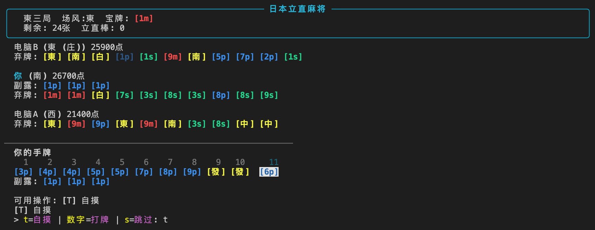
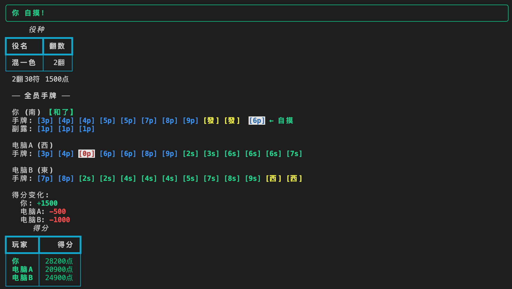
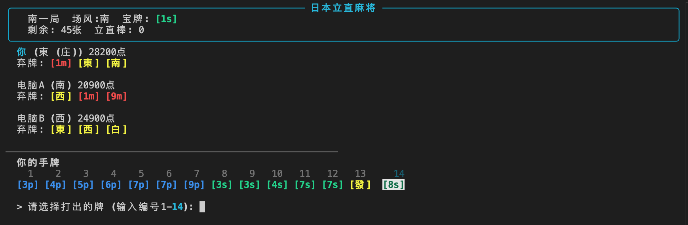

# 🀄️ 日本立直麻将 - 终端CLI

一款功能完整的日本立直麻将终端CLI游戏，支持四人麻（yonma）和三人麻（sanma），多语言界面（中/日/英），使用 Python + Rich 库实现终端渲染。

[](https://pypi.org/project/riichi-mahjong-cli/)

## 预览

| 游戏界面 | 和了结算 |
|---------|---------|
|  |  |



## 功能特性

- **四人麻将** - 半庄战 / 东风战
- **三人麻将** - 半庄战 / 东风战（去2m-8m、禁止吃、北抜き）
- **完整规则引擎** - 30+ 种役种判定、符数计算、得分计算
- **贪心AI对手** - 基于向听数优化的AI，具备基本防守能力
- **观战模式** - AI vs AI 自动对局
- **多语言界面** - 中文/日文/英文，彩色牌面

## 安装

```bash
pipx install riichi-mahjong-cli
```

或使用 pip：

```bash
pip install riichi-mahjong-cli
```

## 快速开始

```bash
riichi
```

或从源码运行：

```bash
python main.py
```

游戏默认中文启动，可在主菜单选项 6 切换语言。

### 运行测试

```bash
pytest tests/
```

## 游戏操作

| 按键 | 操作 |
|------|------|
| 数字 1-14 | 选择打出的牌 |
| `t` | 自摸（和牌） |
| `h` | 荣和（吃铳） |
| `r` | 宣告立直 |
| `p` | 碰 |
| `c` | 吃 |
| `k` | 杠（暗杠/加杠/大明杠） |
| `n` | 北抜き（三麻专用） |
| `9` | 九种九牌流局 |
| `s` | 跳过 |

## 项目结构

```
game/
├── main.py                     # 入口文件（兼容直接运行）
├── mahjong/
│   ├── cli.py                  # CLI入口（riichi 命令）
│   ├── core/                   # 核心数据模型
│   │   ├── tile.py             # 牌定义（136/34双编码，赤宝牌）
│   │   ├── meld.py             # 副露数据结构
│   │   ├── hand.py             # 手牌管理
│   │   ├── wall.py             # 牌山与王牌
│   │   └── player_state.py     # 玩家状态
│   ├── rules/                  # 规则引擎（纯函数，无状态）
│   │   ├── agari.py            # 和了判定
│   │   ├── shanten.py          # 向听数计算
│   │   ├── fu.py               # 符数计算
│   │   ├── yaku.py             # 役种判定（30+种）
│   │   ├── scoring.py          # 得分计算
│   │   ├── furiten.py          # 振听判定
│   │   └── sanma_rules.py      # 三麻特殊规则
│   ├── engine/                 # 游戏引擎
│   │   ├── game.py             # 半庄/东风战管理
│   │   ├── round.py            # 单局流程控制
│   │   ├── action.py           # 动作定义
│   │   ├── event.py            # 事件总线
│   │   └── game_logger.py      # 对局日志
│   ├── player/                 # 玩家抽象与AI
│   │   ├── base.py             # Player抽象基类 + GameView
│   │   ├── human.py            # 人类玩家
│   │   └── greedy_ai.py        # 贪心AI
│   └── ui/                     # 终端UI
│       ├── renderer.py         # Rich渲染引擎
│       ├── tile_display.py     # 牌面显示
│       ├── board_layout.py     # 牌桌布局
│       ├── input_handler.py    # 用户输入处理
│       ├── i18n.py             # 国际化（中/日/英）
│       └── locales/            # 翻译文件
│           ├── zh.py           # 中文
│           ├── ja.py           # 日文
│           └── en.py           # 英文
├── tests/                      # 单元测试（120个）
└── data/
    └── scoring_table.json      # 翻符→点数查询表
```

## 支持的役种

### 1翻
立直、门前清自摸和、断幺九、平和、一杯口、役牌（场风/自风/三元）、一发、海底摸月、河底捞鱼、岭上开花、抢杠

### 2翻
双立直、混全带幺九、一气通贯、三色同顺、三色同刻、对对和、三暗刻、混老头、小三元、七对子

### 3翻
混一色、纯全带幺九、二杯口

### 6翻
清一色

### 役满
国士无双、四暗刻、大三元、小四喜、大四喜、字一色、清老头、绿一色、九莲宝灯、四杠子、天和、地和

## 规则引擎验证

规则引擎已通过 **1,000 局 [天凤](https://tenhou.net/) 真实对局** 牌谱验证，1,000 局全部通过，一致率 100%。

### 验证流程

1. **解析** 天凤 mjlog XML 牌谱文件，转换为结构化事件流（摸牌、弃牌、副露、立直、和了、流局）
2. **重建** 牌山顺序 — 从牌谱中的初始手牌、摸牌顺序、王牌信息反推完整牌山排列
3. **逐步回放** 将牌谱中的每一步动作输入引擎执行，完全复现天凤对局过程
4. **逐步验证**：
   - 每次摸牌、弃牌、副露、立直均通过引擎合法性检查
   - 荣和/自摸的合法性判定（振听、有效役种、得分计算）
   - 终局计分与天凤结果完全一致（符数、番数、点数、支付）
   - 流局时的听牌判定与点数分配一致

```bash
# 运行天凤牌谱验证
pytest tests/tenhou_replay/ -v
```

```
tests/tenhou_replay/test_tenhou_replay.py - 1000 passed
```

### 验证覆盖范围

- 役种判定、符数计算、得分计算在真实对局场景中完全正确
- 振听规则（现物振听、同巡振听、立直振听）行为正确
- 副露合法性（吃、碰、杠）与天凤规则一致
- 边界情况（海底摸月、河底捞鱼、岭上开花、抢杠、双立直等）处理正确

## 设计亮点

- **双编码系统** - 136编码追踪唯一牌身份，34编码用于高效算法计算
- **GameView信息屏障** - AI和人类使用相同接口，保证公平性
- **EventBus解耦** - 引擎通过事件通知UI，便于扩展
- **AI可替换** - 预留标准接口，后期可替换为AI模型

## 依赖

- Python >= 3.10
- rich >= 13.0.0
- pytest >= 7.0.0（开发）

---

## 关于本项目

本项目**完全由 [Claude Code](https://claude.ai/claude-code) 自主实现**，从零开始构建，人类仅提供需求计划文档，全部代码、测试、文档均由 AI 生成。

### 实现信息

| 项目 | 详情 |
|------|------|
| AI 工具 | Claude Code (Anthropic CLI) |
| 模型 | Claude Opus 4.6 (`claude-opus-4-6`) |
| 实现过程 | 单次会话完成全部代码编写与调试 |
| 代码规模 | ~30 个源文件，120 个单元测试 |
| Token 消耗 | 约 200K+ tokens（含计划解析、代码生成、测试修复） |
| 完成日期 | 2025-02-12 |

### 会话日志

完整的 Claude Code 会话日志保存在：

```
.claude/2026-02-12-implement-the-following-plan.txt
```
